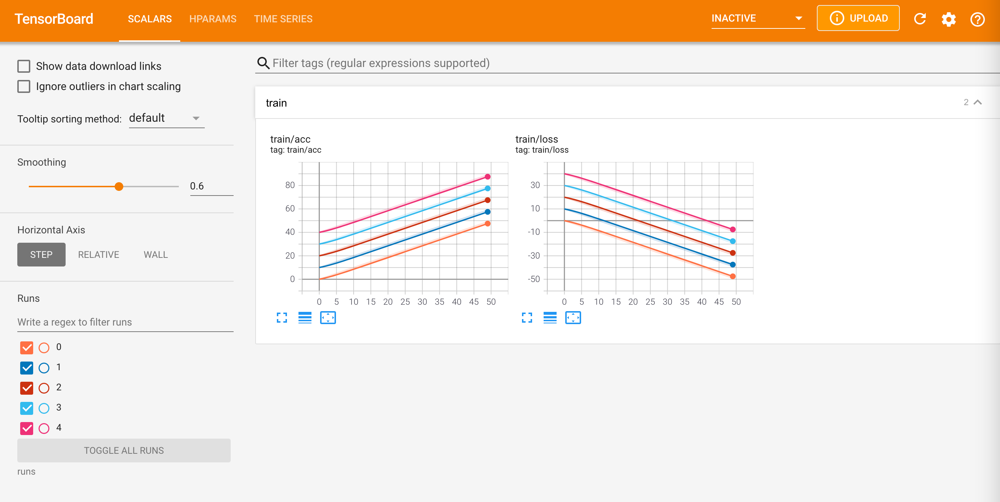
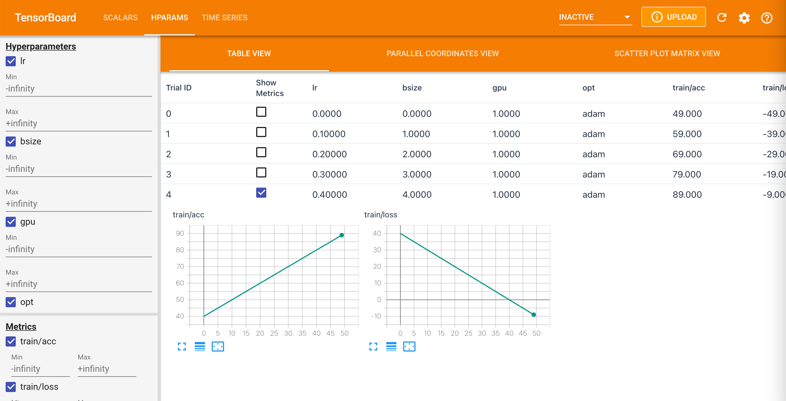
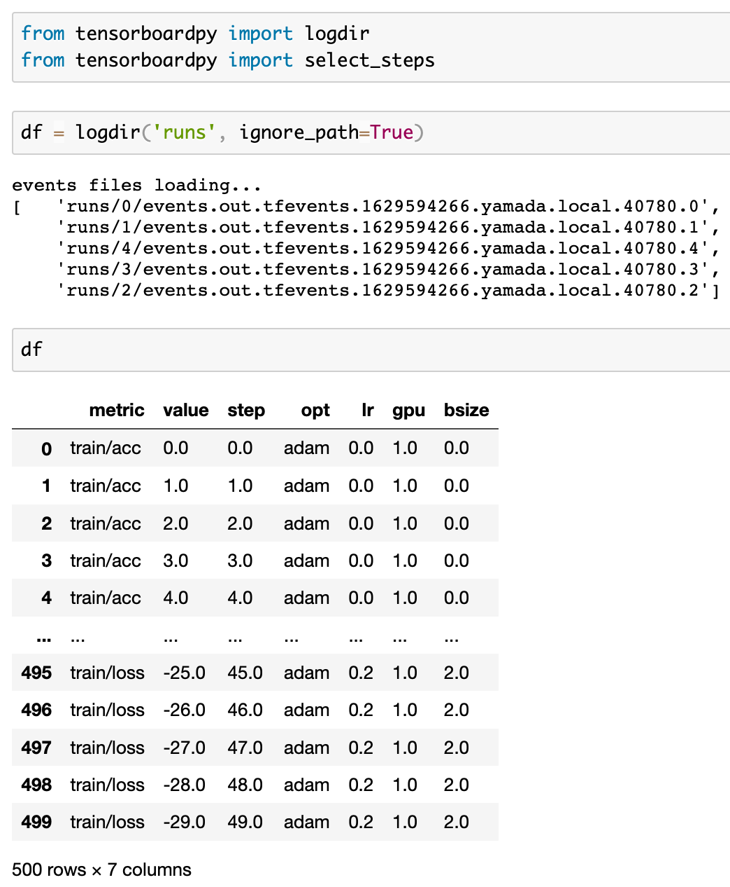

# What is thie repository
Create a pandas dataframe from the tensorboard log!
None: I only checked tensorbaord logs from pytorch.


# install 

```
pip install tensorboardpy
```

# How to use

```
poetry run jupyter notebook
```
# Using image

directory structure
```
runs
├── 0
│   └── events.out.tfevents.xxx.0
├── 1
│   └── events.out.tfevents..xxx.1
├── 2
│   └── events.out.tfevents.xxx.2
├── 3
│   └── events.out.tfevents.xxx.3
└── 4
    └── events.out.tfevents.xxx.4
```



### tensorborad log to pandas
tensorboardpy recursively searches the event file and creates a data frame using the information from hparams and scalaras tags.


## note
My gen_log.py is using a modified torch.utils.tensorabord.

I think add_hparams is mostly used together with add_scalar in deep learning. However, It can't embed the graph of add_scalar in hparams.
See https://github.com/pytorch/pytorch/issues/63725
To do this.
You rewrite add_hparams function in torch/utils/tensorboard/writer.py as

```python
    def add_hparams(self, hparam_dict, metric_dict, hparam_domain_discrete=None, run_name=None):
        torch._C._log_api_usage_once("tensorboard.logging.add_hparams")
        if type(hparam_dict) is not dict or type(metric_dict) is not dict:
            raise TypeError('hparam_dict and metric_dict should be dictionary.')
        exp, ssi, sei = hparams(hparam_dict, metric_dict, hparam_domain_discrete)

        self.file_writer.add_summary(exp)
        self.file_writer.add_summary(ssi)
        self.file_writer.add_summary(sei)
        for k, v in metric_dict.items():
            if v is not None:
                self.add_scalar(k, v)
```

create tensorboard log

```python
from torch.utils.tensorboard import SummaryWriter


for i in range(5):
    save_metrics = {'train/acc': None, 'train/loss': None}
    writer = SummaryWriter(f'runs/{i}')
    for step in range(50):
        writer.add_scalar('train/acc', 10*i+step, step)
        writer.add_scalar('train/loss', 10*i - step, step)
    writer.add_hparams({'lr': 0.1*i, 'bsize': i, 'gpu': True, 'opt': 'adam'}, save_metrics)
writer.close()
```


